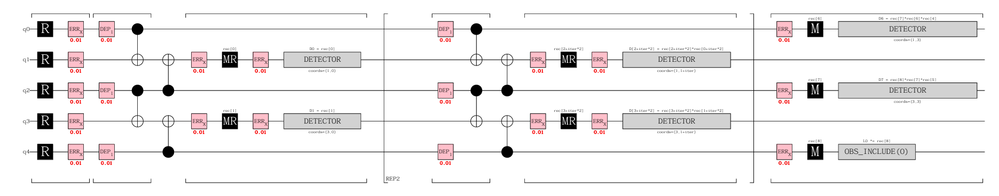
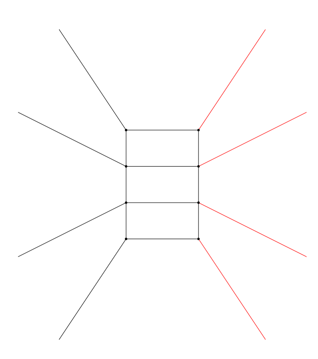
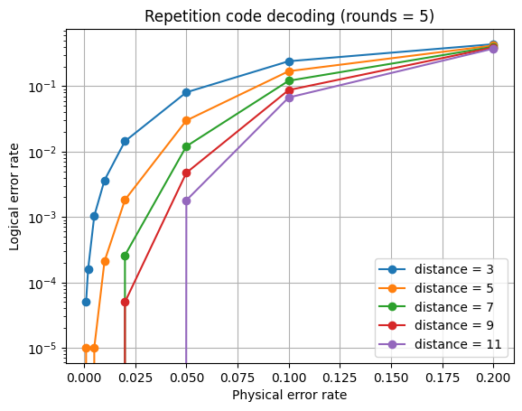

# Quantum Error Correction Pipeline with Stim and PyMatching  
## Repetition Code Threshold Demonstration

This repository demonstrates a complete simulation and decoding pipeline for Quantum Error Correction (QEC) using the repetition code as a minimal working example.

The project combines:

- Stim for fast stabilizer circuit simulation and detector error model generation  
- PyMatching for minimum-weight perfect matching (MWPM) decoding  
- Numerical threshold estimation via logical error rate scaling with code distance  

The goal is to provide a clean, reproducible, and technically transparent example of building a QEC workflow from circuit construction to threshold analysis.

---

## Project Overview

This notebook implements the following pipeline:

1. Construction of a noisy repetition code circuit in Stim  
2. Extraction of the detector error model  
3. Conversion to a decoding graph  
4. Decoding using PyMatching (MWPM)  
5. Monte Carlo sampling of logical error rates  
6. Threshold visualization for different code distances  

The final result demonstrates the convergence of logical error rate curves and reveals the threshold probability of the repetition code.

---

## Circuit Construction

The repetition code is implemented as a repeated syndrome measurement circuit with phenomenological noise.

Key elements:

- Data qubits arranged in a 1D chain  
- Parity-check stabilizers measured via ancilla qubits  
- Repeated rounds of measurement to detect time-like error chains  
- Configurable physical error probability  

Example circuit structure:



The circuit is built using Stim’s circuit description language and compiled into a detector error model for efficient sampling.

---

## Detector Error Model and Decoding Graph

The detector error model extracted from Stim is mapped to a graph structure compatible with PyMatching.

Each detection event corresponds to a node, and error mechanisms generate edges weighted according to log-likelihood ratios.

Example decoding graph:



Decoding is performed using minimum-weight perfect matching (MWPM), which identifies the most likely error configuration consistent with observed detection events.

---

## Threshold Estimation

Monte Carlo simulations are performed for multiple code distances and varying physical error probabilities.

For each configuration:

- A large number of samples is generated  
- Logical failure rate is computed  
- Curves are plotted versus physical error probability  

The threshold is identified at the crossing point of logical error rate curves for increasing code distance.

Example result:



The expected behavior is observed: below threshold, increasing code distance suppresses logical error rate; above threshold, it increases.

---

## Technical Highlights

- Efficient stabilizer simulation using Stim  
- Proper detector error model extraction  
- Graph-based decoding with MWPM  
- Clean separation between simulation, decoding, and analysis  
- Fully reproducible numerical experiment  

This project demonstrates understanding of:

- Stabilizer formalism  
- Syndrome extraction  
- Detector error models  
- Graph-based decoding  
- Statistical threshold estimation  

---

## How to Run


1\. Install dependencies:

```bash

pip install -r requirements.txt

```


2\. Launch Jupyter Notebook:

```bash

jupyter notebook detector_error_model.ipynb

```


3\. Run all cells to reproduce the experiments and plots.

---

## Motivation

Although the repetition code is simple, it captures the essential structure of modern topological QEC:

- Local stabilizer measurements  
- Time-like and space-like error chains  
- Graph-based decoding  
- Threshold behavior  

This makes it an ideal minimal example for demonstrating a complete QEC workflow.
